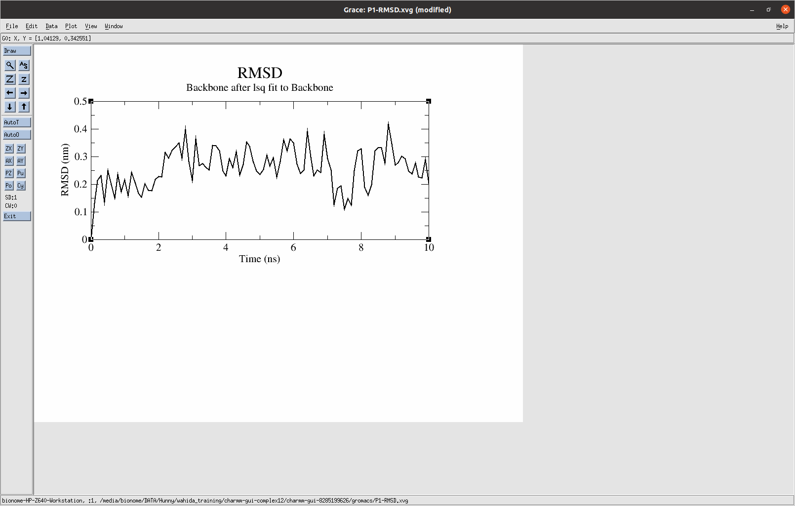
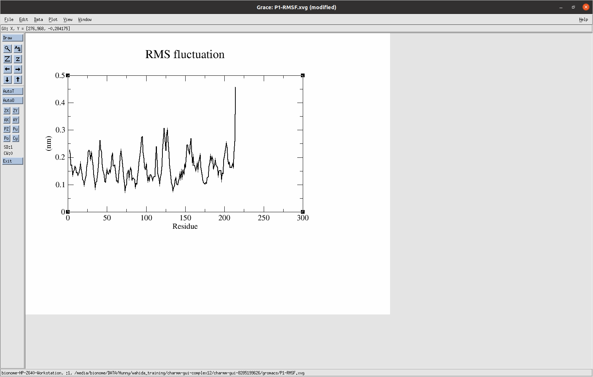
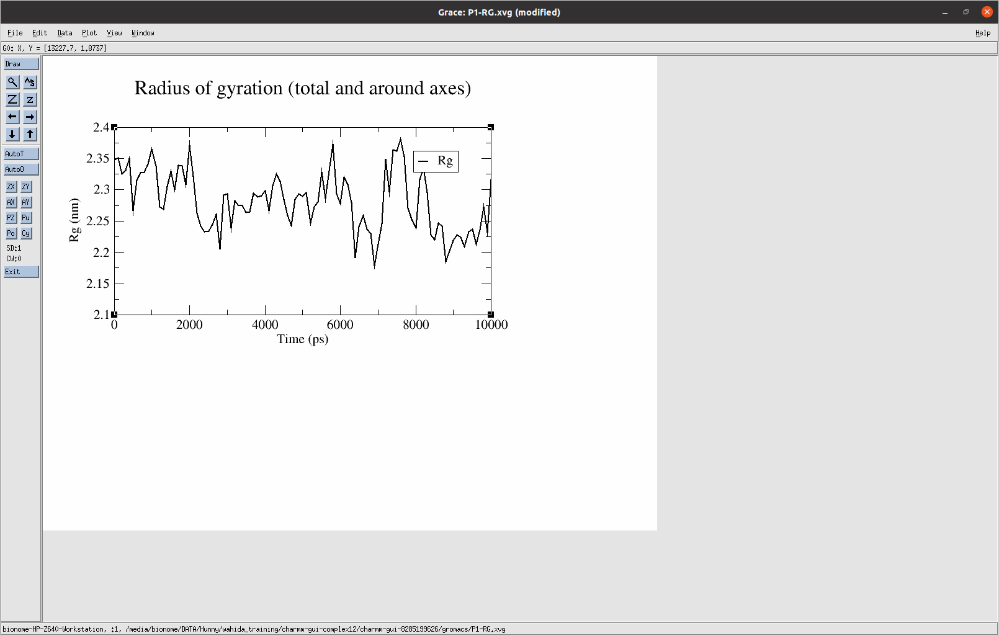
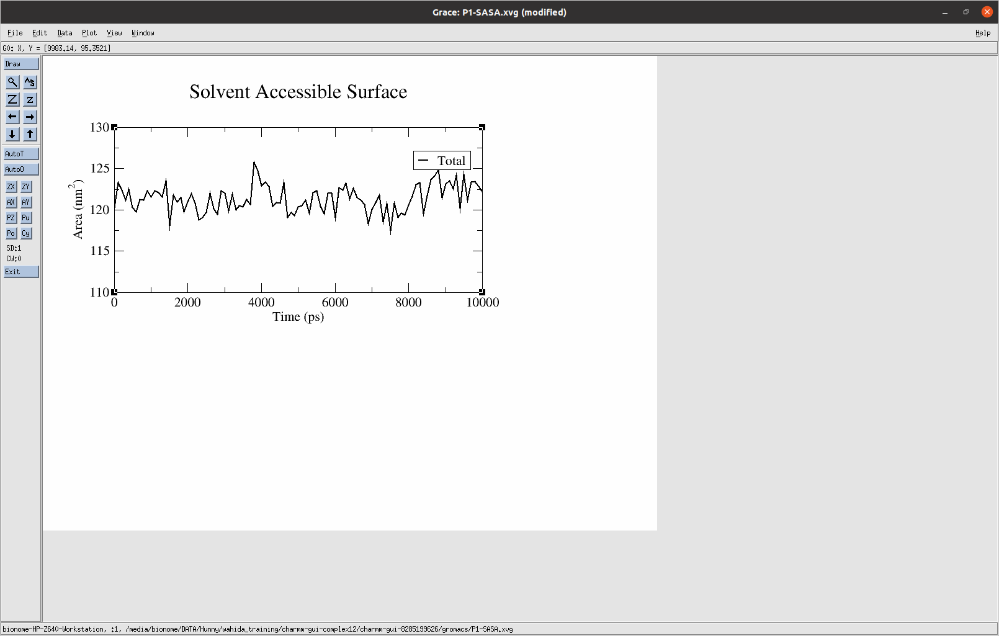

Project 4: Molecular Dynamics Simulation of HER2–Ligand Complex Using GROMACS

Status

Completed

---

Background

Molecular docking predicts the most favorable binding pose between a protein and a ligand. However, docking represents only a static interaction and does not account for the dynamic behavior of the complex under physiological conditions.

Molecular Dynamics (MD) simulation is a computational technique used to study the structural stability, flexibility, and conformational changes of biomolecular systems over time. By simulating atomic movements in a solvated environment, MD provides deeper insights into the stability of protein–ligand complexes beyond docking predictions.

In this project, the HER2–ligand complex obtained from the molecular docking study was subjected to Molecular Dynamics simulation using GROMACS. Several structural parameters, including Root Mean Square Deviation (RMSD), Root Mean Square Fluctuation (RMSF), Radius of Gyration (Rg), and Solvent Accessible Surface Area (SASA), were analyzed to evaluate the stability of the complex.

---

Objective

To investigate the structural stability and dynamic behavior of the HER2–ligand complex through Molecular Dynamics simulation and determine whether the docked complex remains stable throughout the simulation.

---

Protein–Ligand Complex

| Parameter | Details |
|-----------|---------|
| Protein | Human Epidermal Growth Factor Receptor 2 (HER2) |
| Gene | ERBB2 |
| PDB ID | 5TDN |
| Ligand | Top-ranked phytochemical selected from molecular docking |
| Simulation Software | GROMACS |
| System Preparation | CHARMM-GUI |

---

Software Used

- CHARMM-GUI
- GROMACS
- Grace (Xmgrace)
- PyMOL
- BIOVIA Discovery Studio Visualizer

---

Methodology

 Step 1: Selection of Protein–Ligand Complex

The best docked HER2–ligand complex obtained from molecular docking was selected for Molecular Dynamics simulation.

---

 Step 2: System Preparation

The complex was uploaded to CHARMM-GUI, where the simulation system was generated using the CHARMM force field.

---

 Step 3: Solvation

The protein–ligand complex was placed inside a water box to mimic the aqueous biological environment.

---

 Step 4: Ion Addition

Counter ions were added to neutralize the system and maintain electrostatic stability.

---

 Step 5: Energy Minimization

Energy minimization was performed to eliminate steric clashes and optimize the geometry of the simulation system before equilibration.

---

 Step 6: Equilibration

The system underwent equilibration under controlled temperature and pressure conditions to stabilize the simulation environment.

---

 Step 7: Production Molecular Dynamics Simulation

After equilibration, the production Molecular Dynamics simulation was carried out using GROMACS.

---

 Step 8: Trajectory Analysis

The simulation trajectory was analyzed using standard GROMACS analysis tools.

The following analyses were performed:

- Root Mean Square Deviation (RMSD)
- Root Mean Square Fluctuation (RMSF)
- Radius of Gyration (Rg)
- Solvent Accessible Surface Area (SASA)

---

Analysis 1: Root Mean Square Deviation (RMSD)

Purpose

RMSD measures the average deviation of the protein backbone from its initial structure during the simulation. It is commonly used to evaluate the structural stability of a protein–ligand complex.

Observation

The RMSD profile showed an initial increase during the early phase of the simulation, followed by fluctuations within a relatively narrow range for the remaining simulation period.

Interpretation

The initial increase corresponds to structural relaxation after energy minimization and equilibration. Following this adjustment, the protein–ligand complex maintained relatively consistent RMSD values without continuous drift, suggesting that the complex remained structurally stable throughout the simulation.

---

Analysis 2: Root Mean Square Fluctuation (RMSF)

Purpose

RMSF measures the flexibility of individual amino acid residues throughout the simulation.

Observation

Most residues exhibited low to moderate fluctuations, while a few residues near the terminal region showed comparatively higher fluctuations.

Interpretation

The lower RMSF values observed for the majority of residues indicate that the protein backbone remained relatively stable during the simulation. Increased fluctuations at terminal or loop regions are commonly observed due to their inherent flexibility and do not necessarily indicate instability of the overall protein structure.

---

Analysis 3: Radius of Gyration (Rg)

Purpose

Radius of Gyration measures the compactness of the protein structure during Molecular Dynamics simulation.

Observation

The Radius of Gyration remained relatively consistent throughout the simulation with only minor fluctuations.

Interpretation

The stable Rg profile indicates that the HER2 protein maintained its overall compact structural organization during the simulation. No major unfolding or structural collapse was observed.

---

Analysis 4: Solvent Accessible Surface Area (SASA)

Purpose

SASA measures the surface area of the protein exposed to surrounding solvent molecules.

Observation

The SASA values remained relatively stable throughout the simulation with only small fluctuations.

Interpretation

The consistent SASA profile suggests that solvent exposure of the protein remained stable during the simulation, indicating preservation of the overall protein conformation.

---

Overall Results

The Molecular Dynamics simulation demonstrated that the HER2–ligand complex maintained structural stability throughout the simulation period.

The RMSD analysis indicated that the complex reached a relatively stable conformation after initial structural relaxation. RMSF analysis showed that most amino acid residues exhibited low to moderate flexibility, with higher fluctuations mainly observed in terminal or loop regions. The Radius of Gyration remained relatively constant, indicating preservation of the protein's compact structure, while SASA analysis suggested consistent solvent exposure throughout the simulation.

Collectively, these results support the structural stability of the selected HER2–ligand complex under the simulated conditions and provide additional confidence in the molecular docking predictions.

---

Project Deliverables

- CHARMM-GUI generated simulation system
- GROMACS Molecular Dynamics trajectory
- RMSD plot
- RMSF plot
- Radius of Gyration plot
- SASA plot
- Protein–ligand complex structure
- Analysis figures

---

Figures

 Figure 1. Root Mean Square Deviation (RMSD)

  

---

 Figure 2. Root Mean Square Fluctuation (RMSF)

  

---

 Figure 3. Radius of Gyration (Rg)

  

---

 Figure 4. Solvent Accessible Surface Area (SASA)

  

---

 Skills Demonstrated

- Molecular Dynamics Simulation
- GROMACS
- CHARMM-GUI
- Protein–Ligand Stability Analysis
- RMSD Analysis
- RMSF Analysis
- Radius of Gyration Analysis
- SASA Analysis
- Structural Biology
- Computational Drug Discovery

---

 References

1. Abraham MJ et al. GROMACS: High Performance Molecular Simulations through Multi-Level Parallelism. SoftwareX (2015).

2. Jo S. et al. CHARMM-GUI: A Web-Based Graphical User Interface for CHARMM.

3. Protein Data Bank (https://www.rcsb.org)

4. Van Der Spoel D. et al. GROMACS User Manual.

---

 Next Project

➡ Project 5: RNA-Seq Analysis Using Galaxy
