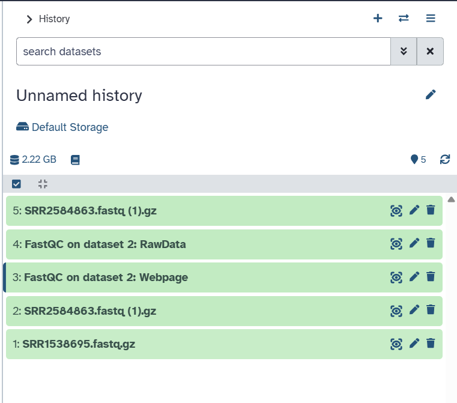
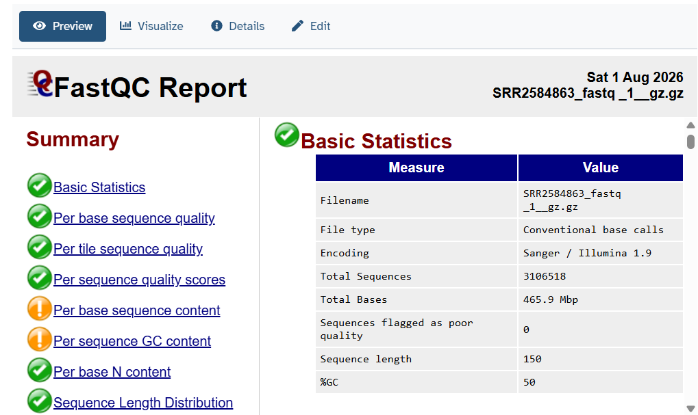
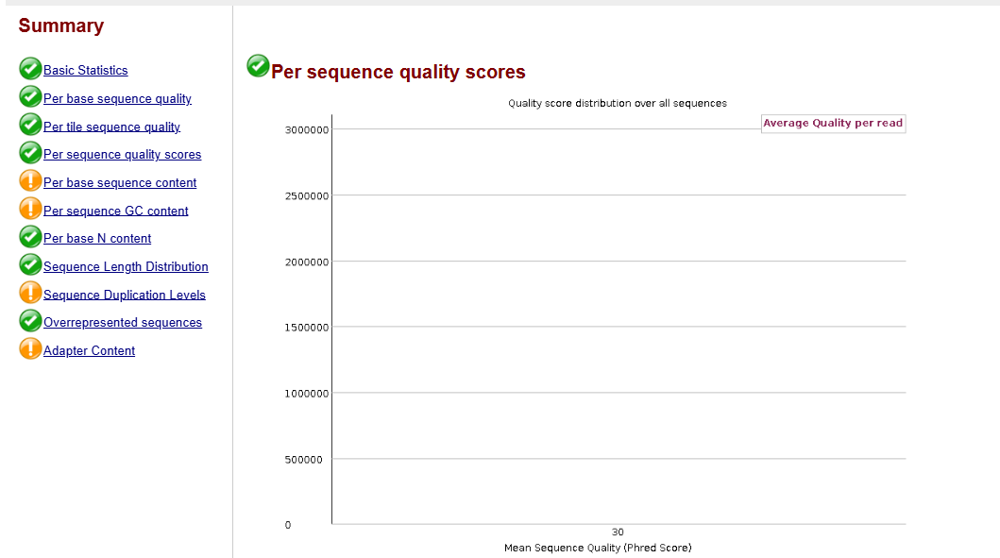
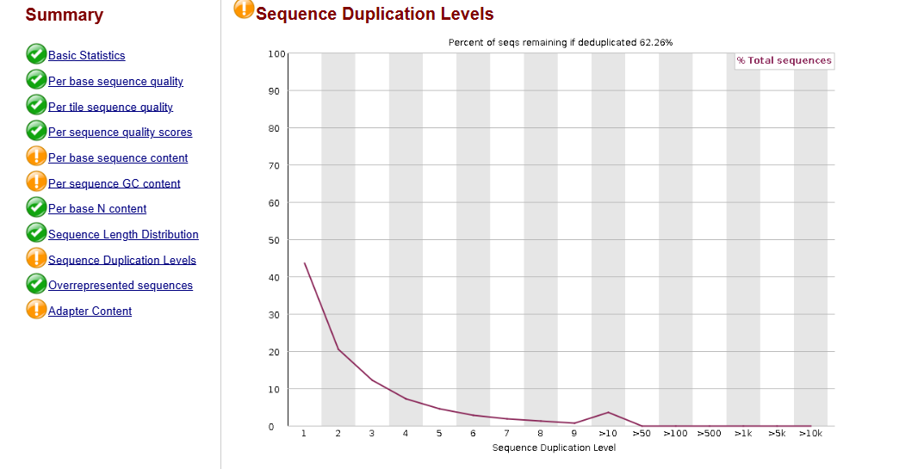
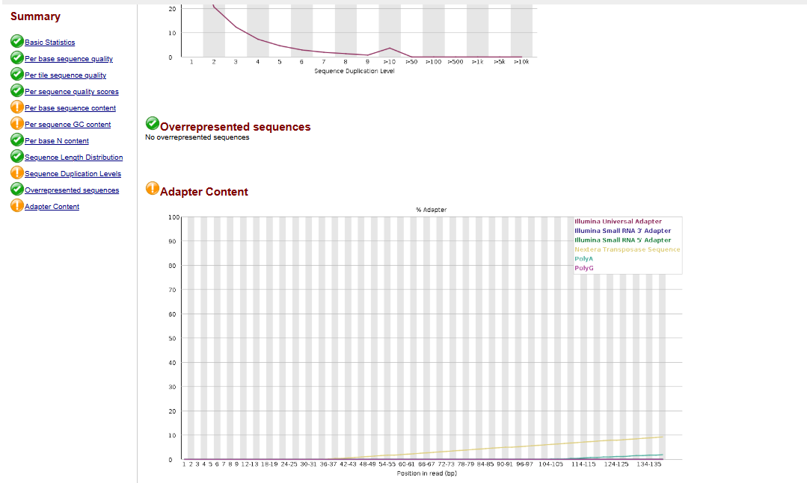
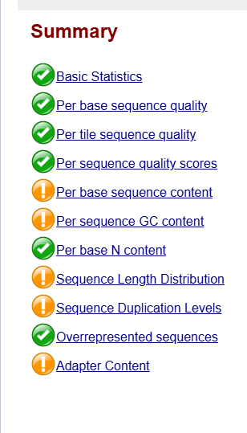
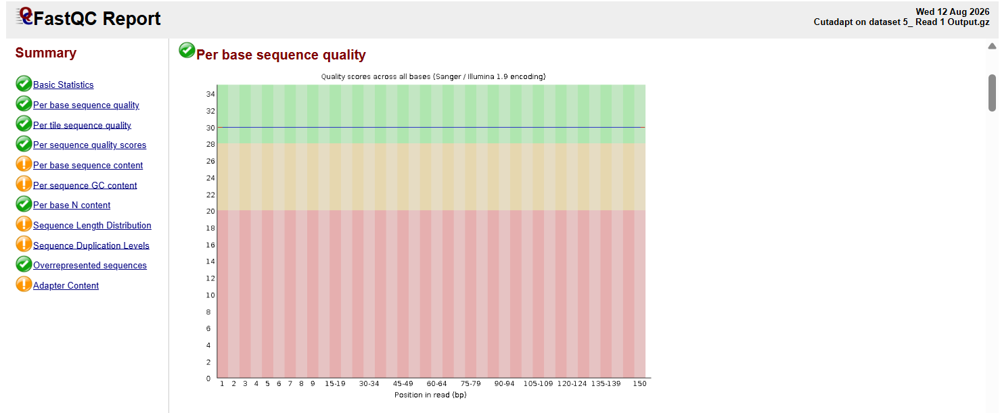
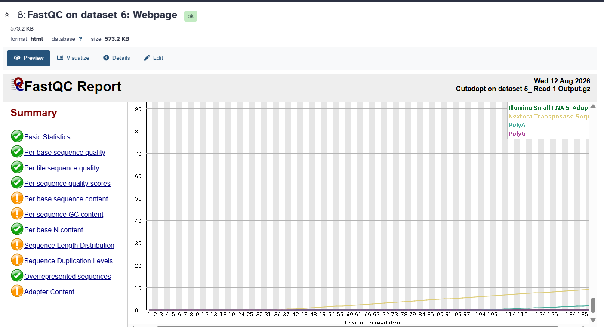
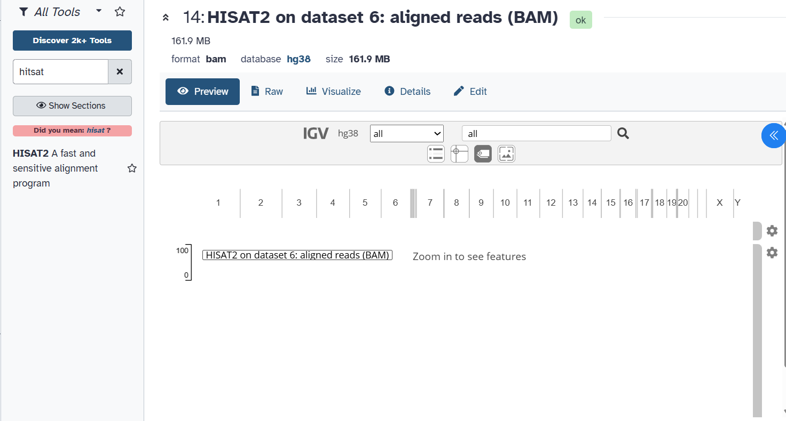

# 🧬 RNA-Seq Analysis of HER2-Positive Breast Cancer Using Galaxy

## 📌 Overview

This project demonstrates an **RNA-Seq preprocessing and alignment workflow for HER2-positive breast cancer** using the **Galaxy platform**.

The analysis includes raw sequencing data quality assessment, preprocessing and trimming, post-trimming quality control, and alignment of RNA-Seq reads to the **human hg38 reference genome**.

This project forms part of the **HER2 Computational Oncology Portfolio** and demonstrates practical skills in next-generation sequencing (NGS) data analysis and bioinformatics.

---

## 🎯 Objectives

The main objectives of this project were to:

* Assess the quality of raw RNA-Seq sequencing data.
* Examine important sequencing quality parameters using FASTQC.
* Identify low-quality reads and potential adapter contamination.
* Perform preprocessing and quality trimming.
* Re-evaluate sequencing quality after trimming.
* Align processed RNA-Seq reads to the human **hg38 reference genome**.
* Document a reproducible RNA-Seq preprocessing and alignment workflow using Galaxy.

---

## 🧪 Dataset Information

| Parameter         | Details                          |
| ----------------- | -------------------------------- |
| Data Type         | RNA-Seq                          |
| Organism          | *Homo sapiens*                   |
| Disease Context   | HER2-Positive Breast Cancer      |
| Reference Genome  | Human hg38                       |
| Analysis Platform | Galaxy                           |
| Data Source       | NCBI Sequence Read Archive (SRA) |

The RNA-Seq sequencing data were imported into **Galaxy** in FASTQ format and used as the starting point for the analysis.

---

# 🔬 RNA-Seq Analysis Workflow

```text
Raw RNA-Seq FASTQ Data
          ↓
       FASTQC
          ↓
Raw Read Quality Assessment
          ↓
Quality Trimming / Preprocessing
          ↓
       FASTQC
          ↓
Post-Trimming Quality Assessment
          ↓
       HISAT2
          ↓
Alignment to Human hg38 Genome
          ↓
Aligned RNA-Seq Reads
```

---

# 1️⃣ RNA-Seq Data Upload to Galaxy

The RNA-Seq FASTQ dataset was first imported into the **Galaxy platform**.

The uploaded sequencing dataset served as the input for the subsequent quality-control and preprocessing steps.

### Galaxy Data Upload


---

# 2️⃣ Raw RNA-Seq Quality Assessment Using FASTQC

The quality of the raw RNA-Seq sequencing reads was assessed using **FASTQC**.

FASTQC provides several quality-control metrics that help identify potential problems in raw sequencing data before downstream analysis.

The following parameters were evaluated:

* Basic statistics
* Per-base sequence quality
* Per-sequence quality scores
* Per-base sequence content
* Per-sequence GC content
* Sequence duplication levels
* Overrepresented sequences
* Per-base N content
* Sequence length distribution

---

## FASTQC Summary

The FASTQC summary provides an overview of the quality status of different sequencing parameters.



---

## Basic Statistics

Basic statistics provide general information about the sequencing dataset, including the total number of sequences, sequence length, and GC content.



---

## Per-Base Sequence Quality

Per-base sequence quality evaluates the distribution of **Phred quality scores** across each position in the sequencing reads.

Higher Phred scores indicate greater confidence in the accuracy of the base calls.


---

## Per-Sequence Quality Scores

This analysis shows the distribution of average quality scores across individual sequencing reads.

It helps identify whether a subset of reads has consistently poor sequencing quality.



---

## Per-Base Sequence Content

Per-base sequence content evaluates the proportion of individual nucleotide bases (**A, T, G, and C**) at each position across the sequencing reads.

Unexpected nucleotide composition may indicate sequence-specific bias.


---

## Per-Sequence GC Content

Per-sequence GC content evaluates the distribution of GC percentages across sequencing reads.

Significant deviations from the expected distribution may indicate sequencing bias or contamination.


---

## Sequence Duplication Levels

Sequence duplication analysis determines the proportion of reads that occur multiple times within the dataset.

High duplication levels can potentially result from PCR amplification, highly expressed transcripts, or sequencing-related biases.



---

## Overrepresented Sequences

FASTQC identifies sequences that occur at unusually high frequencies.

These sequences may represent adapters, highly abundant transcripts, or other sources of sequence bias.



---

## Per-Base N Content

This parameter measures the percentage of bases that could not be confidently identified and were therefore represented as **N**.

A low percentage of N bases generally indicates good sequencing quality.


---

## Sequence Length Distribution

Sequence length distribution shows the distribution of read lengths present in the RNA-Seq dataset.


---

# 3️⃣ RNA-Seq Preprocessing and Quality Trimming

Following the initial quality assessment, the RNA-Seq reads were subjected to **preprocessing and quality trimming**.

The purpose of this step was to remove:

* Low-quality bases
* Poor-quality sequence regions
* Adapter contamination
* Other unwanted sequencing artifacts

Preprocessing improves the reliability of subsequent genome alignment and downstream analysis.

---

# 4️⃣ Post-Trimming Quality Assessment

FASTQC was performed again after preprocessing to determine whether trimming improved the overall quality of the sequencing reads.

## Post-Trimming FASTQC Summary

The post-trimming FASTQC report was examined to assess the overall quality of the processed sequencing reads.



---

## Post-Trimming Per-Base Sequence Quality

Per-base quality was examined again after trimming to evaluate improvements in base-call quality.



---

## Post-Trimming Adapter Content

Adapter content was evaluated after preprocessing to determine whether adapter contamination had been successfully reduced.



---

# 5️⃣ RNA-Seq Alignment Using HISAT2

Following preprocessing and quality control, the RNA-Seq reads were aligned to the **human hg38 reference genome** using **HISAT2**.

HISAT2 is a splice-aware sequence alignment tool commonly used for mapping RNA-Seq reads to reference genomes.

Using a splice-aware aligner is particularly important for RNA-Seq because transcript-derived reads may span exon-exon junctions.

### HISAT2 Alignment to hg38



---

# 🛠️ Tools and Resources Used

| Tool / Resource  | Application                                          |
| ---------------- | ---------------------------------------------------- |
| Galaxy           | Bioinformatics workflow and RNA-Seq analysis         |
| FASTQC           | Raw and post-trimming sequencing quality assessment  |
| Quality Trimming | Removal of low-quality bases and adapter sequences   |
| HISAT2           | RNA-Seq read alignment                               |
| hg38             | Human reference genome                               |
| NCBI SRA         | Source of publicly available RNA-Seq sequencing data |

---

# 📊 Key Outcomes

The RNA-Seq workflow successfully demonstrated:

* Import of RNA-Seq sequencing data into Galaxy.
* Quality assessment of raw sequencing reads using FASTQC.
* Evaluation of multiple sequencing quality parameters.
* Preprocessing and quality trimming of RNA-Seq reads.
* Post-trimming quality assessment.
* Evaluation of adapter contamination after trimming.
* Alignment of processed RNA-Seq reads to the **human hg38 reference genome using HISAT2**.
* Development of a documented and reproducible Galaxy-based RNA-Seq workflow.

---

# 📁 Project Structure

```text
05_RNASeq_Galaxy/
│
├── 01_galaxy_upload.png
├── 02_fastqc_summary.png
├── 03_basic_statistics.png
├── 04_per_base_sequence_quality.png
├── 05_per_sequence_quality.png
├── 06_per_base_sequence_content.png
├── 07_per_sequence_gc_content.png
├── 08_sequence_duplication_levels.png
├── 09_overrepresented_sequences.png
├── 10_per_base_n_content.png
├── 11_sequence_length_distribution.png
├── 12_post_trim_FastQC_summary.png
├── 13_post_trim_per_base_quality.png
├── 14_post_trim_adapter_content.png
├── 15_HISAT2_hg38_alignment.png
└── README.md
```

---

# 🧬 Significance in HER2-Positive Breast Cancer

RNA-Seq provides a powerful approach for studying genome-wide gene expression patterns associated with cancer.

In HER2-positive breast cancer, transcriptomic analysis can contribute to the investigation of:

* Differentially expressed genes
* HER2-associated molecular pathways
* Cancer-related biological processes
* Potential therapeutic targets
* Candidate molecular biomarkers

The preprocessing and alignment workflow performed in this project provides the foundation required for these downstream transcriptomic analyses.

---

# 🔮 Future Scope

The aligned RNA-Seq data can be extended to downstream analyses including:

1. Gene-level read quantification
2. Differential gene expression analysis
3. Identification of upregulated and downregulated genes
4. Volcano plot visualization
5. Heatmap and expression clustering
6. Gene Ontology (GO) enrichment analysis
7. KEGG pathway enrichment analysis
8. Identification of potential HER2-associated biomarkers

---

# 💻 Skills Demonstrated

### Bioinformatics

* RNA-Seq Analysis
* NGS Data Analysis
* Sequencing Quality Control
* FASTQ Data Processing
* RNA-Seq Preprocessing
* Genome Alignment
* Transcriptomics

### Tools

* Galaxy
* FASTQC
* HISAT2
* NCBI SRA

### Research Application

* HER2-Positive Breast Cancer
* Computational Oncology
* Cancer Transcriptomics
* Bioinformatics

---

## 📌 Portfolio

This project is part of the **HER2 Computational Oncology Portfolio**, integrating structural bioinformatics, molecular docking, molecular dynamics, transcriptomics, and functional bioinformatics approaches for the computational investigation of HER2-positive breast cancer.
